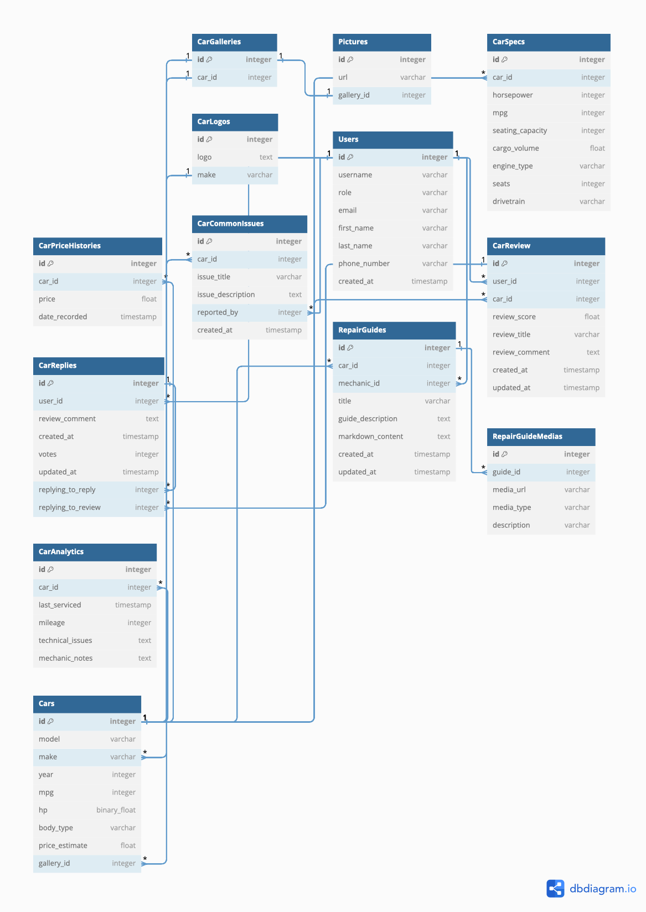

# Entity Relationship Diagram

Reference the Creating an Entity Relationship Diagram final project guide in the course portal for more information about how to complete this deliverable.

## Create the List of Tables

### 1. Cars

Stores general information on cars, including model, make, and pricing estimates.

| Column Name     | Type         | Description                                           |
|-----------------|--------------|-------------------------------------------------------|
| id              | integer      | Primary key, unique identifier for each car           |
| model           | varchar      | Model of the car                                      |
| make            | varchar      | Foreign key referencing `CarLogos.make`               |
| year            | integer      | Year of manufacture                                   |
| mpg             | integer      | Miles per gallon                                      |
| hp              | binary_float | Horsepower of the car                                 |
| body_type       | varchar      | Type of car body                                      |
| price_estimate  | float        | Estimated price of the car                            |
| gallery_id      | integer      | Foreign key referencing `CarGalleries.id`             |

### 2. CarGalleries

Associates cars with their galleries for storing multiple images.

| Column Name     | Type         | Description                                           |
|-----------------|--------------|-------------------------------------------------------|
| id              | integer      | Primary key, unique identifier for each gallery       |
| car_id          | integer      | Foreign key referencing `Cars.id`                     |

### 3. Pictures

Stores URLs of pictures associated with each gallery.

| Column Name     | Type         | Description                                           |
|-----------------|--------------|-------------------------------------------------------|
| id              | integer      | Primary key, unique identifier for each picture       |
| url             | varchar      | URL of the picture                                    |
| gallery_id      | integer      | Foreign key referencing `CarGalleries.id`             |

### 4. CarSpecs

Contains detailed specifications of each car.

| Column Name         | Type         | Description                                      |
|---------------------|--------------|--------------------------------------------------|
| id                  | integer      | Primary key, unique identifier for each spec set |
| car_id              | integer      | Foreign key referencing `Cars.id`                |
| horsepower          | integer      | Horsepower of the car                            |
| mpg                 | integer      | Miles per gallon                                 |
| seating_capacity    | integer      | Number of seats                                  |
| cargo_volume        | float        | Cargo space in cubic feet                        |
| engine_type         | varchar      | Engine type                                      |
| seats               | integer      | Number of seats                                  |
| drivetrain          | varchar      | Type of drivetrain                               |

### 5. CarPriceHistories

Tracks price changes over time for each car.

| Column Name     | Type         | Description                                           |
|-----------------|--------------|-------------------------------------------------------|
| id              | integer      | Primary key, unique identifier for each record        |
| car_id          | integer      | Foreign key referencing `Cars.id`                     |
| price           | float        | Recorded price                                       |
| date_recorded   | timestamp    | Date of the price recording                           |

### 6. CarLogos

Stores car brand logos.

| Column Name     | Type         | Description                                           |
|-----------------|--------------|-------------------------------------------------------|
| id              | integer      | Primary key, unique identifier for each logo          |
| logo            | text         | Image data or URL of the logo                         |
| make            | varchar      | Car brand                                             |

### 7. Users

Contains user information, including contact details and roles.

| Column Name     | Type         | Description                                           |
|-----------------|--------------|-------------------------------------------------------|
| id              | integer      | Primary key, unique identifier for each user          |
| username        | varchar      | Username of the user                                  |
| role            | varchar      | User's role (e.g., regular user, mechanic, admin)     |
| email           | varchar      | User's email address                                  |
| first_name      | varchar      | User's first name                                     |
| last_name       | varchar      | User's last name                                      |
| phone_number    | varchar      | User's phone number                                   |
| created_at      | timestamp    | Account creation date                                 |

### 8. CarReview

Stores reviews for each car made by users.

| Column Name     | Type         | Description                                           |
|-----------------|--------------|-------------------------------------------------------|
| id              | integer      | Primary key, unique identifier for each review        |
| user_id         | integer      | Foreign key referencing `Users.id`                    |
| car_id          | integer      | Foreign key referencing `Cars.id`                     |
| review_score    | float        | Rating score given by the user                        |
| review_title    | varchar      | Title of the review                                   |
| review_comment  | text         | Review text/comment                                   |
| created_at      | timestamp    | Date the review was created                           |
| updated_at      | timestamp    | Last updated date of the review                       |

### 9. CarReplies

Stores replies to reviews, supporting nested replies.

| Column Name         | Type         | Description                                          |
|---------------------|--------------|------------------------------------------------------|
| id                  | integer      | Primary key, unique identifier for each reply        |
| user_id             | integer      | Foreign key referencing `Users.id`                   |
| review_comment      | text         | Reply text                                           |
| created_at          | timestamp    | Date the reply was created                           |
| votes               | integer      | Number of votes on the reply                         |
| updated_at          | timestamp    | Last updated date of the reply                       |
| replying_to_reply   | integer      | Foreign key referencing `CarReplies.id`              |
| replying_to_review  | integer      | Foreign key referencing `CarReview.id`               |

### 10. CarCommonIssues

Lists common issues reported for each car.

| Column Name     | Type         | Description                                           |
|-----------------|--------------|-------------------------------------------------------|
| id              | integer      | Primary key, unique identifier for each issue         |
| car_id          | integer      | Foreign key referencing `Cars.id`                     |
| issue_title     | varchar      | Title of the issue                                    |
| issue_description | text       | Description of the issue                              |
| reported_by     | integer      | Foreign key referencing `Users.id`                    |
| created_at      | timestamp    | Date the issue was reported                           |

### 11. RepairGuides

Contains guides for car repairs, written by mechanics.

| Column Name       | Type         | Description                                         |
|-------------------|--------------|-----------------------------------------------------|
| id                | integer      | Primary key, unique identifier for each guide       |
| car_id            | integer      | Foreign key referencing `Cars.id`                   |
| mechanic_id       | integer      | Foreign key referencing `Users.id`                  |
| title             | varchar      | Title of the repair guide                           |
| guide_description | text         | Description of the guide                            |
| markdown_content  | text         | Markdown content of the guide                       |
| created_at        | timestamp    | Creation date                                       |
| updated_at        | timestamp    | Last updated date                                   |

### 12. RepairGuideMedias

Associates media files with repair guides.

| Column Name     | Type         | Description                                           |
|-----------------|--------------|-------------------------------------------------------|
| id              | integer      | Primary key, unique identifier for each media         |
| guide_id        | integer      | Foreign key referencing `RepairGuides.id`             |
| media_url       | varchar      | URL of the media file                                 |
| media_type      | varchar      | Type of media (e.g., image or gif)                    |
| description     | varchar      | Description of the media for accessibility            |

### 13. CarAnalytics

Tracks various metrics and issues for each car.

| Column Name     | Type         | Description                                           |
|-----------------|--------------|-------------------------------------------------------|
| id              | integer      | Primary key, unique identifier for each record        |
| car_id          | integer      | Foreign key referencing `Cars.id`                     |
| last_serviced   | timestamp    | Last service date                                     |
| mileage         | integer      | Total mileage                                         |
| technical_issues | text        | Describes any technical issues                        |
| mechanic_notes  | text         | Notes from the mechanic                               |


## DBML Syntax

```js
Table Cars {
  id integer [primary key]
  model varchar
  make varchar [ref: > CarLogos.make]
  year integer
  mpg integer
  hp binary_float
  body_type varchar
  price_estimate float
  gallery_id integer [ref: > CarGalleries.id]
}

Table CarGalleries {
  id integer [primary key]
  car_id integer [ref: - Cars.id]
}

Table Pictures {
  id integer [primary key]
  url varchar
  gallery_id integer [ref: - CarGalleries.id]
}

Table CarSpecs {
  id integer [primary key]
  car_id integer [ref: > Cars.id]
  horsepower integer
  mpg integer
  seating_capacity integer
  cargo_volume float
  engine_type varchar
  seats integer
  drivetrain varchar
}

Table CarPriceHistories {
  id integer [primary key]
  car_id integer [ref: > Cars.id]
  price float
  date_recorded timestamp
}

Table CarLogos {
  id integer [primary key]
  logo text
  make varchar
}

Table Users {
  id integer [primary key]
  username varchar
  role varchar // regular user, mechanic, admin
  email varchar
  first_name varchar
  last_name varchar
  phone_number varchar
  created_at timestamp
}

Table CarReview {
  id integer [primary key]
  user_id integer [ref: > Users.id]
  car_id integer [ref: > Cars.id]
  review_score float
  review_title varchar
  review_comment text
  created_at timestamp
  updated_at timestamp
}

Table CarReplies {
  id integer [primary key]
  user_id integer [ref: > Users.id]
  review_comment text
  created_at timestamp
  votes integer
  updated_at timestamp
  replying_to_reply integer [ref: > CarReplies.id]
  replying_to_review integer [ref: > CarReview.id]
}


Table CarCommonIssues {
  id integer [primary key]
  car_id integer [ref: > Cars.id]
  issue_title varchar
  issue_description text
  reported_by integer [ref: > Users.id]
  created_at timestamp
}

Table RepairGuides {
  id integer [primary key]
  car_id integer [ref: > Cars.id]
  mechanic_id integer [ref: > Users.id]
  title varchar
  guide_description text
  markdown_content text // Stores the full Markdown text for the repair guide
  created_at timestamp
  updated_at timestamp
}


Table RepairGuideMedias {
  id integer [primary key]
  guide_id integer [ref: > RepairGuides.id]
  media_url varchar // URL or path to the image or GIF
  media_type varchar // Type of media (e.g., "image" or "gif")
  description varchar // Optional description for accessibility
}


Table CarAnalytics {
  id integer [primary key]
  car_id integer [ref: > Cars.id]
  last_serviced timestamp
  mileage integer
  technical_issues text
  mechanic_notes text
}

```

## Add the Entity Relationship Diagram


