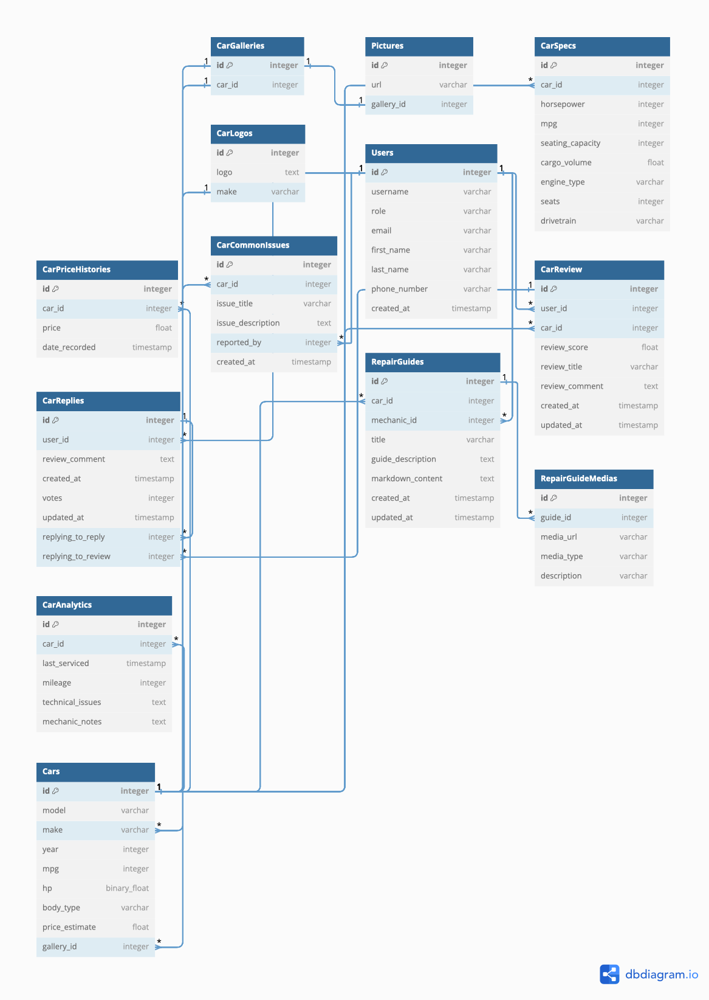

# Entity Relationship Diagram

Reference the Creating an Entity Relationship Diagram final project guide in the course portal for more information about how to complete this deliverable.

## Create the List of Tables

- Cars
- Pictures
- CarGalleries
- CarSpecs
- CarPricesHistories

## DBML Syntax

```json
Table Cars {
  id integer [primary key]
  model varchar
  make varchar [ref: > CarLogos.make]
  year integer
  mpg integer
  hp binary_float
  body_type varchar
  price_estimate float
  gallery_id integer [ref: > CarGalleries.id]
}

Table CarGalleries {
  id integer [primary key]
  car_id integer [ref: - Cars.id]
}

Table Pictures {
  id integer [primary key]
  url varchar
  gallery_id integer [ref: - CarGalleries.id]
}

Table CarSpecs {
  id integer [primary key]
  car_id integer [ref: > Cars.id]
  horsepower integer
  mpg integer
  seating_capacity integer
  cargo_volume float
  engine_type varchar
  seats integer
  drivetrain varchar
}

Table CarPriceHistories {
  id integer [primary key]
  car_id integer [ref: > Cars.id]
  price float
  date_recorded timestamp
}

Table CarLogos {
  id integer [primary key]
  logo text
  make varchar
}

Table Users {
  id integer [primary key]
  username varchar
  role varchar // regular user, mechanic, admin
  email varchar
  first_name varchar
  last_name varchar
  phone_number varchar
  created_at timestamp
}

Table CarReview {
  id integer [primary key]
  user_id integer [ref: > Users.id]
  car_id integer [ref: > Cars.id]
  review_score float
  review_title varchar
  review_comment text
  created_at timestamp
  updated_at timestamp
}

Table CarReplies {
  id integer [primary key]
  user_id integer [ref: > Users.id]
  review_comment text
  created_at timestamp
  votes integer
  updated_at timestamp
  replying_to_reply integer [ref: > CarReplies.id]
  replying_to_review integer [ref: > CarReview.id]
}


Table CarCommonIssues {
  id integer [primary key]
  car_id integer [ref: > Cars.id]
  issue_title varchar
  issue_description text
  reported_by integer [ref: > Users.id]
  created_at timestamp
}

Table RepairGuides {
  id integer [primary key]
  car_id integer [ref: > Cars.id]
  mechanic_id integer [ref: > Users.id]
  title varchar
  guide_description text
  markdown_content text // Stores the full Markdown text for the repair guide
  created_at timestamp
  updated_at timestamp
}


Table RepairGuideMedias {
  id integer [primary key]
  guide_id integer [ref: > RepairGuides.id]
  media_url varchar // URL or path to the image or GIF
  media_type varchar // Type of media (e.g., "image" or "gif")
  description varchar // Optional description for accessibility
}


Table CarAnalytics {
  id integer [primary key]
  car_id integer [ref: > Cars.id]
  last_serviced timestamp
  mileage integer
  technical_issues text
  mechanic_notes text
}

```

## Add the Entity Relationship Diagram

