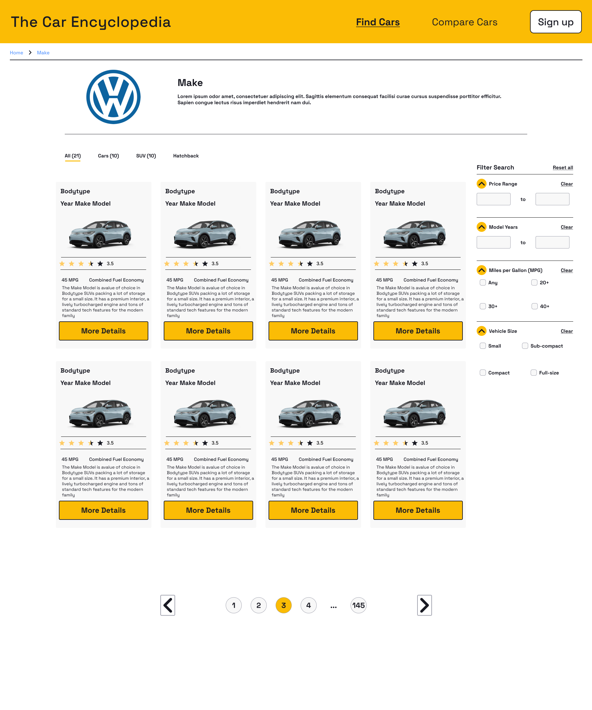
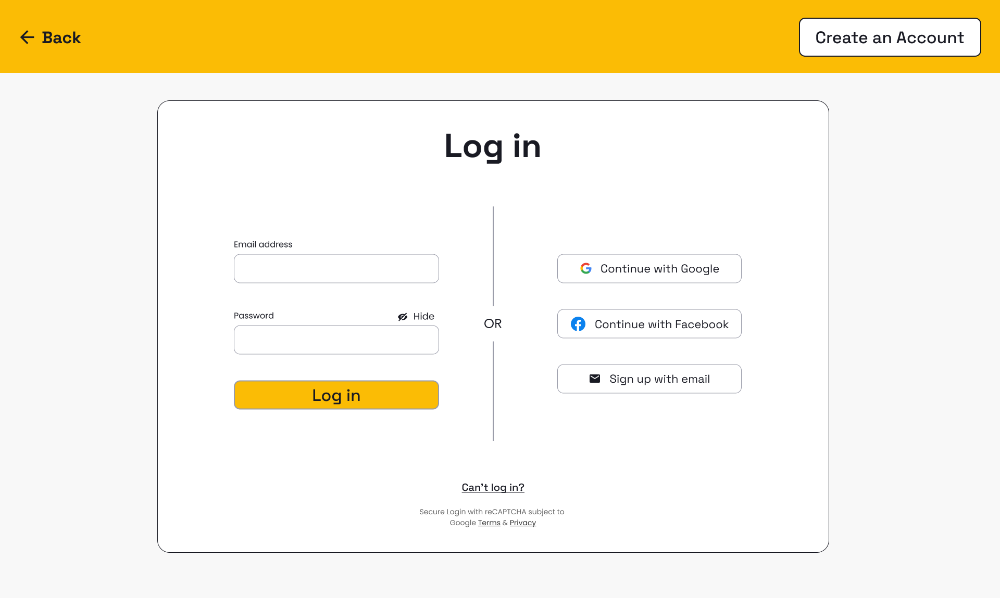
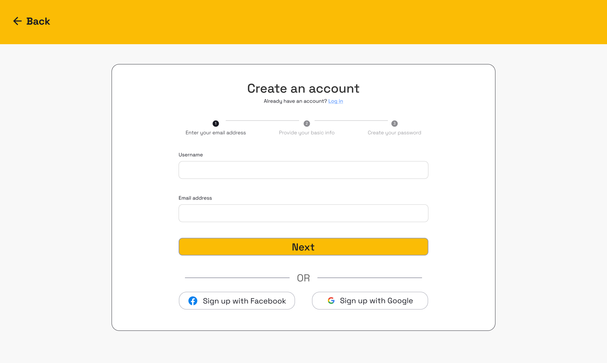
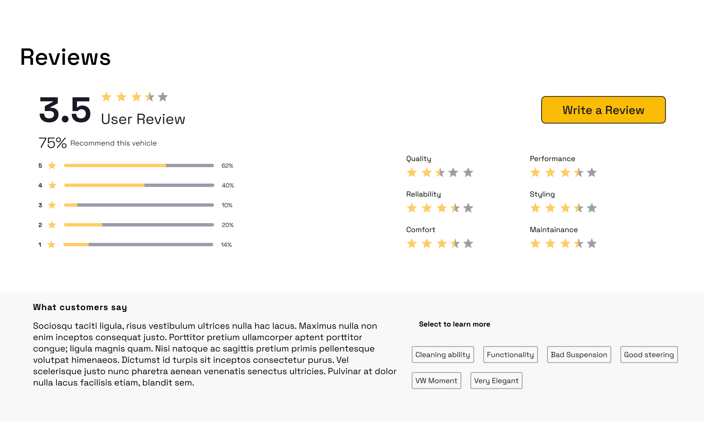

# Wireframes

Reference the Creating an Entity Relationship Diagram final project guide in the course portal for more information about how to complete this deliverable.

## List of Pages

[👉🏾👉🏾👉🏾 List the pages you expect to have in your app, with a ⭐ next to pages you have wireframed]

## Wireframe 1: Car Search

## Wireframe 2: Login Page

## Wireframe 3: Sign up Page

[👉🏾👉🏾👉🏾 include more wireframes as desired]

## Wireframe 4: Landing Page

[👉🏾👉🏾👉🏾 include wireframe 3]

[👉🏾👉🏾👉🏾 include more wireframes as desired]

## Wireframe 5: Car Information Page

